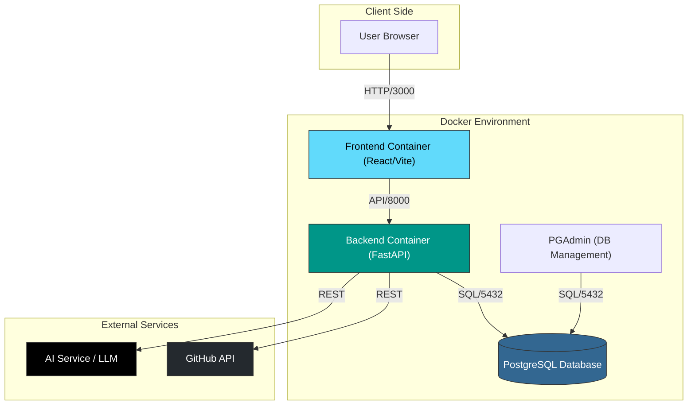
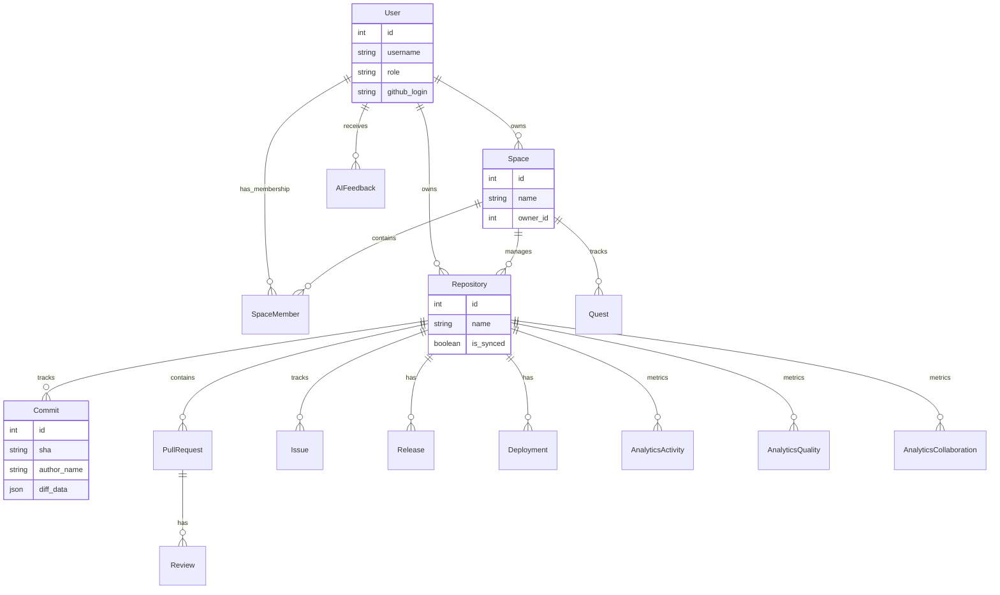

<div align="center">

# 🏟️ GitArena

### GitHub Analytics & AI Platform

*Empowering developers and teams with actionable insights from their GitHub repositories*


[](https://github.com/Efrat-Wilinger/-GitArena)
[](https://www.docker.com/)

[Features](#-features) • [Quick Start](#-quick-start) • [Architecture](#-architecture--schema) • [Team](#-team)

</div>

---

## 📋 Table of Contents

- [About](#-about)
- [Quick Start](#-quick-start)
- [Features](#-features)
- [Architecture & Schema](#%EF%B8%8F-architecture--schema)
- [Technology Stack](#-technology-stack)
- [Project Structure](#-project-structure)
- [API Documentation](#-api-documentation)
- [Development](#-development)
- [Contributing](#-contributing)

---

## 🎯 About

**GitArena** is a comprehensive GitHub analytics platform that transforms raw repository data into meaningful insights. Built for developers and teams who want to understand their development patterns, improve code quality, and enhance collaboration.

### 🎖️ Sprint 1 - Complete ✅
Our first sprint delivers the foundation:
- ✅ **Story 205**: GitHub OAuth Login with JWT authentication
- ✅ **Story 207**: Repository selection and synchronization
- ✅ **Story 210**: Commit pulling and daily sync automation
- ✅ **Story 239**: Docker Compose infrastructure

---

## 🚀 Quick Start

### Prerequisites
*   [Docker Desktop](https://www.docker.com/products/docker-desktop/) 🐳
*   [Node.js 20+](https://nodejs.org/) (for local dev without Docker)
*   GitHub OAuth App Credentials 🔑

### 1️⃣ Setup GitHub OAuth App
1. Navigate to [GitHub Developer Settings](https://github.com/settings/developers)
2. Click **"New OAuth App"**
3. Fill in the details:
   ```
   Application name: GitArena
   Homepage URL: http://localhost:3000
   Authorization callback URL: http://localhost:3000/auth/callback
   ```
4. Copy your **Client ID** and generate a **Client Secret**.

### 2️⃣ Clone & Configure
```bash
git clone <repo_url>
cd GitArena
```

### 3️⃣ Configure Environment
You need to set up the secrets for both Frontend and Backend.

**Backend (`/backend/.env`):**
```bash
cd backend
cp .env.example .env
# Edit .env with your DATABASE_URL and GITHUB credentials
```

**Frontend (`/frontend/.env`):**
```bash
cd ../frontend
cp .env.example .env
# Edit .env and ensure VITE_API_URL=http://localhost:8000
```

### 4️⃣ Launch with Docker
```bash
cd ..
docker-compose up --build -d
```
*   Wait a few minutes for the build to complete.
*   The database will automatically initialize.

### 5️⃣ Access the Application
| Service | URL | Description |
|---------|-----|-------------|
| 🌐 **Frontend** | http://localhost:3000 | Main application |
| 🔧 **Backend API** | http://localhost:8000 | REST API |
| 📚 **API Docs** | http://localhost:8000/docs | Interactive API documentation |
| 🗄️ **Database Admin** | http://localhost:5050 | PGAdmin (Login: `efrat.wilinger@gmail.com` / `12345`) |

---

## ✨ Features

### 🔐 Authentication & Security
- **GitHub OAuth Integration** - Seamless login with your GitHub account
- **JWT Authentication** - Secure token-based authentication
- **Role-Based Access Control** - Manage team permissions

### 📊 Analytics Dashboard
- **Repository Insights** - Track commits, PRs, and code changes
- **Team Metrics** - Understand collaboration patterns
- **Activity Tracking** - Monitor development velocity
- **Visual Reports** - Beautiful charts and graphs

### 🔄 Synchronization
- **Automatic Sync** - Daily repository updates
- **On-Demand Refresh** - Manual sync when needed

---

## 🏗️ Architecture & Schema

### ⚡ System Architecture
The system runs on a containerized microservices-like architecture managed by Docker Compose.



### 🧠 Database Schema (ERD)
A live visualization of our data relationships. The `User` is at the center, managing `Spaces` and contributing to `Repositories`.



---

## 🛠️ Technology Stack

<table>
<tr>
<td width="50%">

### Backend
-  **FastAPI** - Modern, fast web framework
-  **PostgreSQL** - Robust database
-  **SQLAlchemy** - Powerful ORM
-  **Alembic** - Database migrations

</td>
<td width="50%">

### Frontend
-  **React 18** - UI framework
-  **TypeScript** - Type safety
-  **Vite** - Lightning-fast builds
-  **TailwindCSS** - Utility-first styling
-  **Recharts** - Data visualization

</td>
</tr>
</table>

---

## 📁 Project Structure

```
GitArena/
│
├── 🔙 backend/                    # Python FastAPI Backend
│   ├── app/
│   │   ├── modules/              # Domain modules (users, analytics, spaces)
│   │   ├── shared/               # Shared logic (DB, Auth, Models)
│   │   └── main.py               # App entry
│   └── tests/                    # Backend tests
│
├── 🎨 frontend/                   # React TypeScript Frontend
│   ├── src/
│   │   ├── api/                  # API clients
│   │   ├── components/           # Reusable UI components
│   │   └── pages/                # Route pages
│   └── Dockerfile
│
├── 🐳 docker-compose.yml         # Container orchestration
└── 📖 README.md                  # You are here!
```

---

## 📚 API Documentation

### 🔐 Authentication
| Method | Endpoint | Description |
|--------|----------|-------------|
| `POST` | `/auth/github/login` | Initiate GitHub OAuth flow |
| `GET` | `/auth/github/callback` | OAuth callback handler |

### 📊 Analytics
| Method | Endpoint | Description |
|--------|----------|-------------|
| `GET` | `/analytics/dashboard` | Get dashboard statistics |
| `GET` | `/analytics/activity` | Get activity metrics |
| `GET` | `/analytics/manager/team` | Get team performance stats |

> 💡 **Tip**: Visit [http://localhost:8000/docs](http://localhost:8000/docs) for full interactive documentation.

---

## 💻 Development

### Running Without Docker

#### Backend Setup
```bash
cd backend
python -m venv venv
# Windows:
venv\Scripts\activate
# Mac/Linux:
source venv/bin/activate
pip install -r requirements.txt
cp .env.example .env
alembic upgrade head
uvicorn app.main:app --reload
```

#### Frontend Setup
```bash
cd frontend
npm install
npm run dev
```

---

## 🤝 Contributing

We welcome contributions!
1. 🍴 Fork the repository
2. 🌿 Create a feature branch (`git checkout -b feature/AmazingFeature`)
3. 💾 Commit your changes (`git commit -m 'Add some AmazingFeature'`)
4. 🔀 Open a Pull Request

---

<div align="center">

### 🌟 Star us on GitHub!

If you find GitArena useful, please consider giving it a star ⭐

[⬆ Back to Top](#️-gitarena)

</div>
