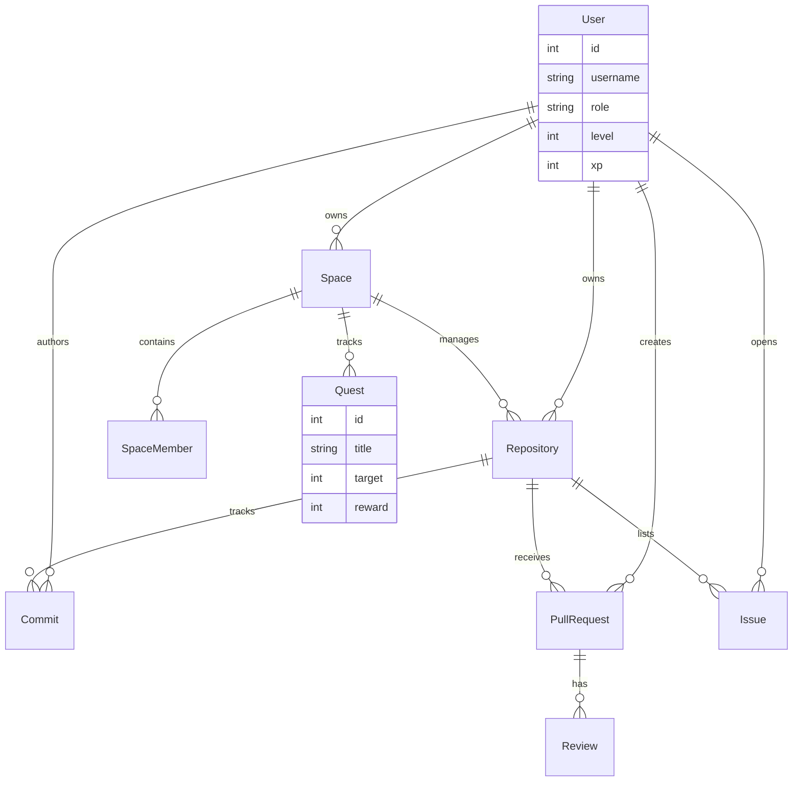
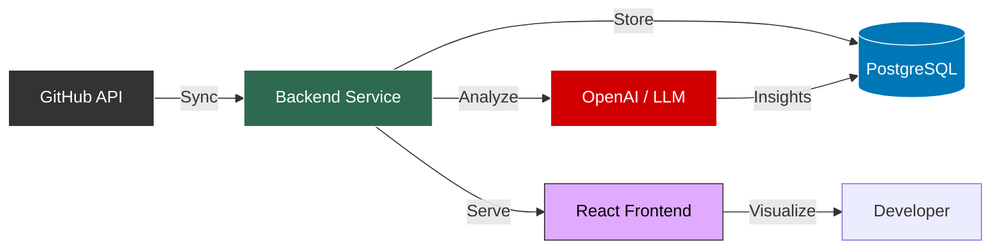

# 🏟️ GitArena

> **Where Code Meets Gaming.** Transform your development workflow into an immersive RPG experience.


---

## 🌟 Introduction

**GitArena** isn't just a dashboard; it's a **productivity engine**. By Gamifying the software development lifecycle, we turn every commit, pull request, and code review into a quest for excellence.

The system adapts its interface based on your role (`manager` or `member`), providing tailored experiences for leadership and individual contributors.

---

## 👑 The Manager Command Center
**Location**: `Dashboard` (when logged in as Manager)

A high-density control panel designed for engineering leaders. It provides a 360-degree view of team health, velocity, and bottlenecks.

### 1. Header & Quick Stats
- **Sync All Data**: Triggers a background job to fetch fresh data from GitHub for all linked repositories.
- **Key Metrics Row**:
    - 📂 **Active Repos**: Number of repositories currently being tracked.
    - 💻 **Total Commits**: Aggregate commit count across all projects.
    - 🔀 **Pull Requests**: Open and closed PR count.
    - 👥 **Team Size**: Number of unique contributors detected.

### 2. Engineering Health (Dora Metrics) 🚀
Visualizes the four key DevOps metrics (DORA):
- **Deployment Frequency**: How often code is shipped.
- **Lead Time**: Time from first commit to deployment.
- **Change Failure Rate**: Percentage of deployments causing failure.
- **MTTR**: Mean Time To Recovery from failures.

### 3. Immediate Attention ⚠️
- **Bottleneck Alerts**: AI-driven detection of stalled work.
    - 🔴 **Stale PRs**: Open >7 days with no activity.
    - 🟡 **High Churn**: PRs with excessive review cycles (>5 reviews).
- **Burnout Monitor**: Tracks commit patterns to identify devs working late nights or weekends consistently.

### 4. Planning & Capacity ⚖️
- **Team Capacity Widget**:
    - **Health Score**: Overall team balance (0-100).
    - **Velocity**: Average commits/day per developer.
    - **Sprint Output**: Predicted commit volume for the next sprint.
    - **Load Distribution**: Lists each member as "Optimal", "Overloaded", or "Underutilized".
- **Knowledge Base Tracking**:
    - Monitors `README.md` and `CONTRIBUTING.md` presence.
    - Tracks "Documentation Ratio" (commits touching docs vs code).
- **Leaderboard**:
    - Gamified ranking of top contributors based on weighted score (PRs=3pts, Reviews=2pts, Commits=1pt).

### 5. Deep Dive Analytics 📊
- **Review Network**: A force-directed graph showing who reviews whose code (identifies silos).
- **Commit History**: Animated timeline of commit volume.
- **Activity Heatmap**: Visual grid of when the team is most active (time of day vs day of week).

---

## 👤 The Member Dashboard
**Location**: `Dashboard` (when logged in as Member)

Focused on personal productivity, gamification, and self-improvement.

### 1. Personal Stats
- **Level & XP**: Current gamified status.
- **Daily Streak**: Consecutive days with contributions.
- **Quest Log**: Active challenges assigned by managers (e.g., "Fix 5 Bugs", "Review 3 PRs").

### 2. My Work
- **Assigned Issues**: GitHub issues assigned to you.
- **Pending Reviews**: PRs waiting for your review.
- **My PRs**: Status of PRs you created (Draft, Open, Merged).

### 3. AI Mentor 🤖
- **Personal Insights**: precise feedback on your coding style and habits.
- **Growth Tips**: AI-suggested areas for improvement based on recent code commits.

---

## 🎮 Gamification Mechanics

- **XP Calculation**:
    - Commit: +10 XP
    - Merge PR: +50 XP
    - Code Review: +30 XP
    - Bug Fix (Issue Closed): +40 XP
- **Leveling**:
    - Level 1-10: Novice
    - Level 11-30: Intermediate
    - Level 31-50: Senior
    - Level 50+: Legend

---

## ⚙️ Workflows

### 🟣 Sprint Planning
1.  Manager checks **Capacity Planning** widget.
2.  Identifies "Underutilized" members.
3.  Checks **Knowledge Base** score.
4.  Assigns a new Quest: "Update Documentation" to the underutilized members.
5.  Balances the load for the upcoming sprint.

### 🟡 Handling a Bottleneck
1.  Manager sees a 🔴 **Stale PR** alert on the Dashboard.
2.  Clicks the alert to open the PR in GitHub.
3.  Determines cause (blocked? forgotten?).
4.  Re-assigns or pings the reviewer.
5.  Alert disappears on next sync.

---

## 🏗️ Architecture & Schema

We believe in **Transparent Architecture**. Here is the blueprint of our world.

### 🧠 The Neural Core (Database Schema)

A live visualization of our data relationships. The `User` is at the center of the universe, commanding `Repositories` and joining `Spaces`.



### ⚡ System Flow



---

## 🚀 Speed Run (Quick Start)

Get access to the arena in less than 5 minutes.

### 📋 Prerequisites
*   [Docker Desktop](https://www.docker.com/products/docker-desktop/) 🐳
*   GitHub OAuth App Credentials 🔑

### 🎮 Press Start
1.  **Summon the Code**
    ```bash
    git clone <repo_url>
    cd GitArena
    ```

2.  **Equip Items (Config)**
    ```bash
    # Backend Setup
    cd backend
    cp .env.example .env
    # EDIT .env with your keys!
    
    # Frontend Setup
    cd ../frontend
    cp .env.example .env
    ```

3.  **Launch Server**
    ```bash
    cd ..
    docker-compose up --build
    ```

4.  **Enter the Arena**
    *   **Frontend**: [http://localhost:3000](http://localhost:3000)
    *   **Docs**: [http://localhost:8000/docs](http://localhost:8000/docs)

---

## 🛠️ The Armory (Tech Stack)

| Component | Tech | Description |
|-----------|------|-------------|
| **Core** |  | The brain of the operation. |
| **API** |  | High-speed magic. |
| **UI** |  | Reactive crystalline interface. |
| **Styling** |  | Aesthetic engine. |
| **Data** |  | Persistent memory vault. |
| **Infra** |  | Containerized deployment units. |

---

## 🤝 Join the Party

We are looking for contributors!
1.  Fork the Quest.
2.  Create your Feature Branch (`git checkout -b feature/EpicLoot`).
3.  Open a Pull Request.

---

<p align="center">
  Made with ⚔️ and 🛡️ by the <b>GitArena Team</b>
</p>
