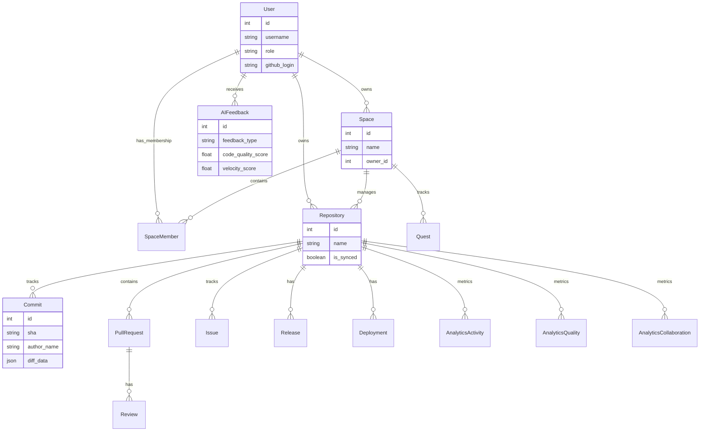
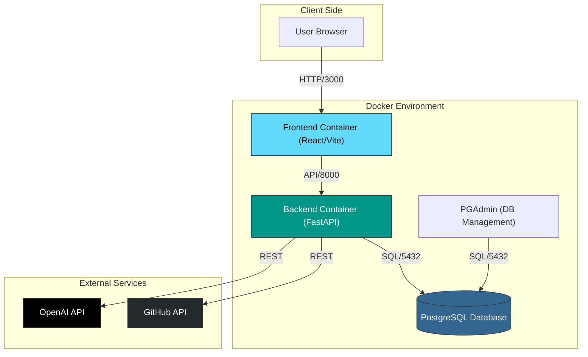

# 🏟️ GitArena

> **Where Code Meets Gaming.** Transform your development workflow into an immersive RPG experience.


---

## 🌟 Introduction

**GitArena** isn't just a dashboard; it's a **productivity engine**. By Gamifying the software development lifecycle, we turn every commit, pull request, and code review into a quest for excellence.

The system adapts its interface based on your role (`manager` or `member`), providing tailored experiences for leadership and individual contributors.

---

## 🏗️ Architecture & Schema

### 🧠 Database Schema (ERD)

A live visualization of our data relationships. The `User` is at the center, managing `Spaces` and contributing to `Repositories`.



### ⚡ System Architecture

The system runs on a containerized microservices-like architecture managed by Docker Compose.



---

## 🚀 Speed Run (Quick Start)

### 📋 Prerequisites
*   [Docker Desktop](https://www.docker.com/products/docker-desktop/) 🐳
*   [Node.js 18+](https://nodejs.org/) (for local dev without Docker)
*   [Python 3.12](https://www.python.org/) (for local dev without Docker)
*   GitHub OAuth App Credentials 🔑

### 🛠️ Installation Guide

Follow these steps to set up the project on a new machine.

#### 1. Clone the Repository
```bash
git clone <repo_url>
cd GitArena
```

#### 2. Configure Environment Variables
You need to set up the secrets for both Frontend and Backend.

**Backend (`/backend/.env`):**
```bash
# Copy the example file
cd backend
cp .env.example .env
```
*Edit `.env` and fill in:*
*   `DATABASE_URL`: `postgresql://postgres:newpassword123@db:5432/gitarena`
*   `SECRET_KEY`: (Generate a random string)
*   `GITHUB_CLIENT_ID`: (From GitHub Developer Settings)
*   `GITHUB_CLIENT_SECRET`: (From GitHub Developer Settings)
*   `OPENAI_API_KEY`: (Your OpenAI Key)

**Frontend (`/frontend/.env`):**
```bash
# Copy the example file
cd ../frontend
cp .env.example .env
```
*Edit `.env` and fill in:*
*   `VITE_API_URL`: `http://localhost:8000`

#### 3. Launch with Docker (Recommended)
This will start the Database, Backend, and Frontend containers.

```bash
cd ..
docker-compose up --build -d
```
*   Wait a few minutes for the build to complete.
*   The database will automatically initialize.

#### 4. Verify Installation
*   **Frontend**: Open [http://localhost:3000](http://localhost:3000)
*   **Backend API Docs**: Open [http://localhost:8000/docs](http://localhost:8000/docs)
*   **PGAdmin**: Open [http://localhost:5050](http://localhost:5050) (Login: `efrat.wilinger@gmail.com` / `12345`)

---

## 🧪 Running Tests

To ensure everything is working correctly:

```bash
# Run Backend Tests
docker-compose exec backend pytest

# Run Frontend Linting
cd frontend
npm run lint
```

---

## 🤝 Contributing

We are looking for contributors!
1.  Fork the Quest.
2.  Create your Feature Branch (`git checkout -b feature/EpicLoot`).
3.  Open a Pull Request.

---

<p align="center">
  Made with ⚔️ and 🛡️ by the <b>GitArena Team</b>
</p>
