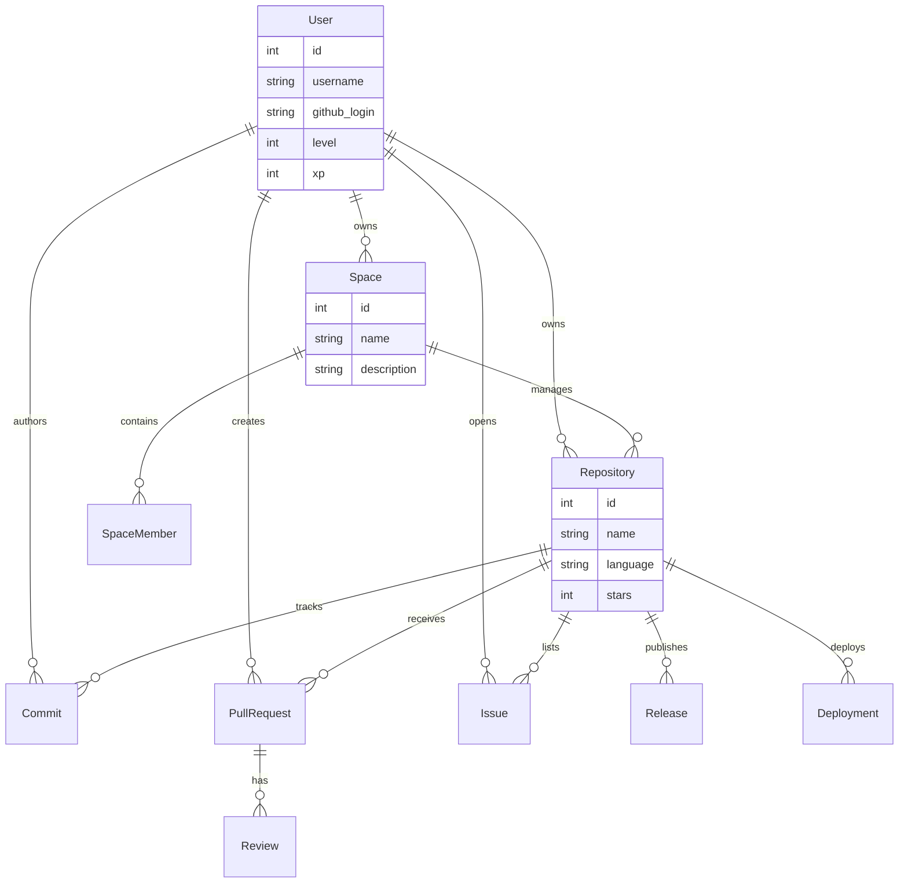

# 🏟️ GitArena

> **Where Code Meets Gaming.** Transform your development workflow into an immersive RPG experience.


---

## 🌟 Introduction

**GitArena** isn't just a dashboard; it's a **productivity engine**. By Gamifying the software development lifecycle, we turn every commit, pull request, and code review into a quest for excellence.

Elevate your engineering team's performance with:
*   **XP & Leveling System**: Get rewarded for consistent, high-quality contributions.
*   **AI Dungeon Master**: Our LLM-powered engine analyzes your code and provides "loot" (insights) and "quests" (challenges).
*   **Team Raids**: Collaborate to clear technical debt and ship features.

---

## 🏗️ Architecture & Schema

We believe in **Transparent Architecture**. Here is the blueprint of our world.

### 🧠 The Neural Core (Database Schema)

A live visualization of our data relationships. The `User` is at the center of the universe, commanding `Repositories` and joining `Spaces`.



### ⚡ System Flow

How data flows from GitHub to your screen:


---

## 🚀 Speed Run (Quick Start)

Get access to the arena in less than 5 minutes.

### 📋 Prerequisites
*   [Docker Desktop](https://www.docker.com/products/docker-desktop/) 🐳
*   GitHub OAuth App Credentials 🔑

### 🎮 Press Start
1.  **Summon the Code**
    ```bash
    git clone <repo_url>
    cd GitArena
    ```

2.  **Equip Items (Config)**
    ```bash
    # Backend Setup
    cd backend
    cp .env.example .env
    # EDIT .env with your keys!
    
    # Frontend Setup
    cd ../frontend
    cp .env.example .env
    ```

3.  **Launch Server**
    ```bash
    cd ..
    docker-compose up --build
    ```

4.  **Enter the Arena**
    *   **Frontend**: [http://localhost:3000](http://localhost:3000)
    *   **Docs**: [http://localhost:8000/docs](http://localhost:8000/docs)

---

## � Workflow: Database Migrations

Keep the realm synchronized. We use **Alembic** for schema evolution.

> **Visual Guide**: `Model Change` -> `Migration Script` -> `Apply to DB`

### How to Introduce New Content (Tables/Columns)

1.  **Design**: Edit `backend/app/shared/models.py`.
2.  **Manifest**: Create the migration spell.
    ```bash
    # Inside backend container/venv
    alembic revision --autogenerate -m "Summon new table"
    ```
3.  **Sync**: Push the new file in `migrations/versions/` to Git.
4.  **Refresh**: Restart your container to apply.

---

## 🛠️ The Armory (Tech Stack)

| Component | Tech | Description |
|-----------|------|-------------|
| **Core** |  | The brain of the operation. |
| **API** |  | High-speed magic. |
| **UI** |  | Reactive crystalline interface. |
| **Data** |  | Persistent memory vault. |
| **Infra** |  | Containerized deployment units. |

---

## 🤝 Join the Party

We are looking for contributors!
1.  Fork the Quest.
2.  Create your Feature Branch (`git checkout -b feature/EpicLoot`).
3.  Commit your Changes (`git commit -m 'Add EpicLoot'`).
4.  Push to the Branch (`git push origin feature/EpicLoot`).
5.  Open a Pull Request.

---

<p align="center">
  Made with ⚔️ and 🛡️ by the <b>GitArena Team</b>
</p>
